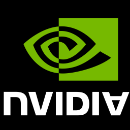

# Discrete GPU

*It's gonna be okay this time. It's gonna be okay it's gonna be okay.*

## helpful links

- https://www.rapidtables.com/math/symbols/Logic_Symbols.html
- https://en.wikipedia.org/wiki/Greek_alphabet
- https://en.wikipedia.org/wiki/List_of_logic_symbols
